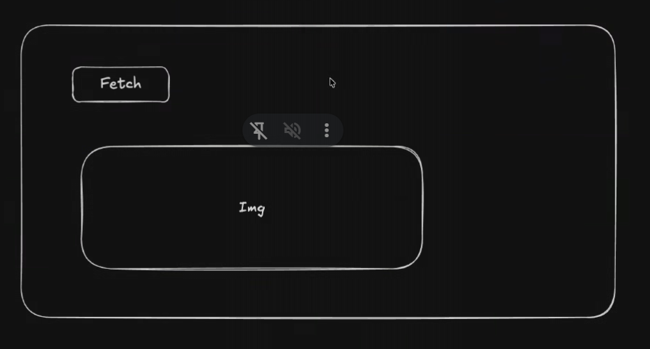

# Random Dog Picture Fetcher

A small React application that displays a random dog picture using the [Dog CEO API](https://dog.ceo/dog-api/).

The app fetches a picture automatically when it loads. Select **Fetch** to request another random picture. Loading and error messages are shown while the request is in progress or if it fails.

## Requirements

- Node.js 18 or newer
- npm

## Getting started

1. Install the dependencies:

   ```bash
   npm install
   ```

2. Start the development server:

   ```bash
   npm run dev
   ```

3. Open the local URL printed by Vite in your browser.

## Available scripts

| Command           | Description                                        |
| ----------------- | -------------------------------------------------- |
| `npm run dev`     | Start the Vite development server with hot reload. |
| `npm run build`   | Create a production build in `dist`.               |
| `npm run preview` | Preview the production build locally.              |
| `npm run lint`    | Check the JavaScript and JSX files with ESLint.    |

## How it works

The main component uses React `useState` to track the image URL, loading state, and any error message. A `useEffect` call requests the first image after the component mounts. The **Fetch** button calls the same request function to load a new image.

When the request succeeds, the image URL is read from the API response's `message` property and rendered in an `` element. If the request fails, the error message is displayed instead.

## API

Random pictures are requested from:

```text
https://dog.ceo/api/breeds/image/random
```

The API returns JSON similar to:

```json
{
	"message": "https://images.dog.ceo/breeds/...",
	"status": "success"
}
```

An internet connection is required when loading or refreshing a picture.

## Tech stack

- React
- Vite
- JavaScript and JSX
- React Hooks (`useState` and `useEffect`)
- Fetch API

## Problem Statement
